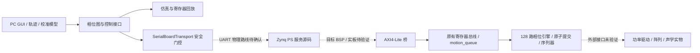

# SonoField-FPGA 当前 v2 接手指南

更新：2026-10-03。当前模型记录：GPT-6.1 Sol High；版本仍为 v2，分支 main。

**内部132MHz核心时序和完整数字回归已通过；PRE_PCB_BOARD_READY=NO。不要直接下载并连接阵列。** 最新恢复入口依次是 README、AGENTS、shared/PROJECT_STATE.json、VERSION_STATE.json、CONTEXT_CHECKPOINT、CURRENT_PLAN、DECISIONS、BLOCKERS、ACCEPTANCE、v2/evidence/pre_pcb_board_ready/RESULT.md。

## 获取完整历史与受支持的活动工作区

使用 Git clone 继续开发；GitHub ZIP 可用于查看源码/原理图，但不包含用于冻结核验的 Git 历史。完整历史保留在克隆对象中；推荐 sparse 工作区仅展开活动工程与资料，避免历史v1原始CRLF字节哈希和平台 checkout 规范化的已知差异。不要为解决差异修改冻结v1。

```powershell
git -c core.autocrlf=false clone --filter=blob:none --sparse https://github.com/loverlike1216/SonoField-FPGA.git SonoField-FPGA
Set-Location SonoField-FPGA
git sparse-checkout set v2 shared AI-interaction-memory AI-chat-memory AI-problem PCB Zynq7020 parameter_detection
git status --short
git branch --show-current
```

根目录文件自动展开，所有版本历史可用。工作区路径由同事自行选择，不依赖本机E/G盘。新 pin workbook/image 位于 v2/hardware/board/references/20261003_user；BOM位于v2/hardware/bom；原理图位于PCB/V1，仍是草稿，禁止据此直接制造。

## Windows 环境

默认PowerShell7 (`pwsh`)，不使用WindowsPowerShell5.1。已验证Python3.10.11、Vivado2025.2、Icarus和本机GCC；本机路径不是同事默认路径。安装同版本工具并设置自身路径。

```powershell
py -3.10 -m venv .venv
.venv/Scripts/python.exe -m pip install -r v2/requirements-lock.txt
$env:VIVADO_BIN='D:/Vivado/2025.2/2025.2/Vivado/bin' # 换成自身安装路径
$env:IVERILOG_BIN='C:/iverilog/bin'                  # 换成自身安装路径
$env:CC='D:/DevC++/Dev-Cpp/TDM-GCC-64/bin/gcc.exe'   # 换成自身GCC
$env:PYTHONUTF8='1'
$env:PYTHONIOENCODING='utf-8'
```

真实串口依赖requirements-board.txt，但安装依赖不意味着允许打开串口。ARM目标工具链和BSP单独核验，hostGCC的DLL不是PS可运行ELF。

## 快速与完整数字复现

```powershell
pwsh -NoProfile -File v2/scripts/run_pre_pcb.ps1
.venv/Scripts/python.exe v2/scripts/board_transport_gate.py --output evidence/pre_pcb_board_ready/team_axi
.venv/Scripts/python.exe v2/scripts/motion_gate.py --output evidence/pre_pcb_board_ready/team_regression
```

快速门禁应返回队列/调度器原新逐周期相等、11周期吞吐、双阵列独立禁用双模拟器PASS和冻结核验PASS。完整门禁应返回115Python测试、全部继承/ADC/校准、3次Icarus+1次XSim、每次3696帧、四组 canonical哈希相同。使用新证据目录，保留所有失败。GUI关闭不代表工程通过，读取summary.json。

仿真进程900秒wall-time超时是SIMULATOR_PROCESS_TIMEOUT，区别于RTL周期超时；不要增大RTL ACK参数或删assert。首次并行两次Vivado布线与多次GUI仿真曾造成进程超时，失败保留。复现完整运动门禁时避免同时运行多个重型EDA任务。

## Vivado 内部时序复现与结果窗口

```powershell
New-Item -ItemType Directory -Force v2/build/pre_pcb | Out-Null
& "$env:VIVADO_BIN/vivado.bat" -mode batch -source v2/scripts/pre_pcb_timing.tcl -log v2/build/pre_pcb/team_timing.log -journal v2/build/pre_pcb/team_timing.jou -tclargs strategy3 evidence/pre_pcb_board_ready/timing/team_reproduction
& "$env:VIVADO_BIN/vivado.bat" -mode gui -source v2/scripts/show_pre_pcb_results.tcl
```

策略源码快照在timing/strategy3；DCP按脚本在本机生成，未提交大型生成物。已有归档输出目录会拒绝覆盖。PASS标准WNS>=0,TNS0,WHS>=0,THS0,路由错误0,内部无约束0；本次实测+0.082/0/+0.072/0。余量较小，板级集成必须重新实现。OOC报告保留外部延时缺失、PS7缺失、BRAM异步控制和LUT复位警告，不得当作完整板级PASS。结果页在evidence/pre_pcb_board_ready/RESULT.html，可离线浏览。

## 板卡检测、已确认和未确认

```powershell
pwsh -NoProfile -File v2/scripts/pre_pcb_detect.ps1 -OutputPath v2/evidence/pre_pcb_board_ready/team_board
```

仅枚举设备，不打开COM。JTAG脚本pre_pcb_jtag.tcl需要现有hw_server localhost3121，限定单目标，读取后关闭批处理连接；不得改驱动/EEPROM/Boot或下载程序。当前VID0403/PID6010/REV0700、COM4、ARM DAP4BA00477、XC7Z02023727093均为实读；完整XC7Z020-1CLG400C来自用户确认。COM编号可能变化，不能硬编码COM4作为通用默认。

新Excel优先于历史const；N18/33.333MHz是用户批准fallback。clock_facts记录候选MMCM131.998680MHz与名义132MHz的10ppm差异，最终板级参数/PLL/PS/AXI配置尚未冻结。J3/J6 bank34、J4 bank35、J5跨两bank；5V引脚不说明VCCO。具体缺失事实与操作要求见MISSING_PHYSICAL_FACTS.md和MANUAL_VCCO_MEASUREMENT_REQUIRED.md。

## 下一开发顺序

1. 获取本板 bank34/35电压、连接器方向/连续性、FTDI-B的UART/MIO与DTR/RTS、PS参考时钟/复位/匹配preset。
2. 生成并审查XSA/BSP/目标ELF、PS↔PL时钟复位/AXI；裸板烟雾顶层禁用所有外部输出。
3. 真实100→1000PING/PONG、安全寄存器回读、既有MAP命令实现与原子提交/ACK序列、错误/断链/超时、ILA、真实GUI。当前C服务只有BASIC，不假装已实现真实MAP。
4. 资格化独立阵列禁用适配器和J3/J4/J5/J6、电气预算/负载、IO标准和外部时序，再冻结PCB接口并连接外部硬件。
5. 10mm换能器逐颗测量，再做两只对向与轻粒子测试；5/10/25/50mg需称重、尺寸/密度和电气/环境证据。

## 连续性与证据维护

只继续v2，不自动升级，不改历史模型来源或冻结v1，不改接口/寄存器/相位语义、不force-push。重大结果更新shared、CONTEXT_CHECKPOINT、AI-interaction-memory，提交并验证远端commit。ChatGPT聊天不可访问时保持BLOCKED，不伪造历史/Decision。GPS原照片和原始USB/网络标识只保留本地，公开引用和哈希已保存。原始上传文件可不可用不影响已归档源码/引脚资料的数字复现。

下面旧指南保留其历史标签范围，不能覆盖上述当前恢复入口。

---

# SonoField-FPGA 项目接手与继续开发指南

更新日期：2026-09-29。面向从 GitHub 获取完整项目的组内同事。

**当前可交接成果是 v2 软件、RTL 与离线验证工程；尚不是可下载上板并实现悬浮的成品。**

## 1. 检查点、版本与阅读顺序

| 项目 | 当前值 |
|---|---|
| PROJECT_ID / 名称 | SONOFIELD_FPGA / SonoField-FPGA |
| 正式仓库 | https://github.com/loverlike1216/SonoField-FPGA.git |
| 活跃版本 / 主分支 | v2 / main；v1 冻结，未建立 v3 |
| 当前工程阶段 | BOARD_TRANSPORT_AND_PS_PL_INTEGRATION_PREFLIGHT |
| 本次阶段标签 | `v2-board-transport-offline-20260929` |
| 标签性质 | 带说明的 Git 阶段检查点；不是正式 Release、硬件验收或版本升级 |
| 已验证工程源码 | `b7f285896f78334d66091328f46aa4f657504430` |
| 本次整理前的完整证据提交 | `b2aed93d89cc833ae8a32e9045ec56040f1de678` |
| 本次交接变化 | 指南、入口说明、检查点元数据及交接验证；不改变功能源码/RTL |
| 阶段结论 | OFFLINE_INTEGRATION_PASS；工程自检 ACCEPT WITH LIMITATIONS |
| 真实板卡通信 | REAL_TRANSPORT_BLOCKED_BY_BOARD_FACT |
| 整个平台 | 尚不满足硬件交付；独立 Review 待完成；NOT_RELEASED / NOT_DEPLOYED |

标签指向包含本指南和交接证据的提交。`main` 后续会前进；需要重现本次状态时以标签为准。用 `git rev-parse 'v2-board-transport-offline-20260929^{commit}'` 获取其准确提交，不把带注释标签对象的 SHA 当作提交 SHA。

首次阅读顺序：本指南 → [机器状态](shared/PROJECT_STATE.json) → [工程状态](shared/ENGINEERING_STATE.json) → [工程阻塞](shared/BLOCKERS_ENGINEERING.md) → [本阶段报告](v2/evidence/board_transport/RESULT.md) → [时序待决策问题](AI-problem/problem/P-20260927-001__candidate-core-timing.md)。

历史 `shared/CURRENT_PLAN.md`、`DECISIONS.md`、`ACCEPTANCE.md`、`HANDOFF.md`、`v2/README.md` 等可能仍描述旧阶段；已标记 DOCUMENTATION_UPDATE_REQUIRED。旧文档与当前工程证据冲突时，以机器状态、代码和真实日志为准，不根据旧文本重新打开硬件输出。本次用户明确授权 Codex 编写交接指南；Work 未启动，未同步或补造聊天记录。

## 2. 已实现到哪一步



实线表示已有实现关系，不代表全部链路已在实板闭环。已分别测试 PC↔实际编译的 C 服务、AXI↔真实 native RTL；尚无完整实板 PC→UART→PS→AXI→PL→PC 回读，也没有完整 C/RTL 联合仿真。

| 模块/阶段 | 已实现和已验证 | 证据入口 |
|---|---|---|
| 几何与声场 | 上下各 8×8，共 128 路；10 mm 名义直径、12 mm 辐射面中心距；面间距 100 mm，可配置 90–115 mm；原点为辐射面几何中心 | [几何配置](v2/config/acoustic_baseline.json)、[机械资料](v2/hardware/mechanical/geometry_10mm) |
| 相位与数字输出 | 8 bit 请求相位和独立校准相位、共同时间基准、完整图原子提交、安全禁用、序列化；Python/Icarus/XSim 交叉验证 | [完整回归](v2/evidence/board_transport/regression_complete/summary.json) |
| 自校准 | 合成采集/TOF/相位/位姿/扫频/健康度与 LUT；1024×8 ADC 数据精确往返；128 次短采集 RTL 扫描 | [校准证据](v2/evidence/board_transport/regression_complete/regression/self_calibration/summary.json) |
| 交互与运动 | 仿真 GUI、中心/点移/圆形/矩形/Z 方向轨迹、队列、故障处理；3696 帧三轮 Icarus 与一轮 XSim 哈希一致 | [运动回归](v2/evidence/board_transport/regression_complete/summary.json) |
| PC/PS 协议 | SFP2 帧、版本/序号/长度/CRC、握手、重复检测、超时、状态读取、安全禁用；15 项协议/后端测试 | [协议测试](v2/evidence/board_transport/protocol_tests.json) |
| PS/PL 桥 | AXI4-Lite→既有寄存器总线；24 项桥接检查及实际系统 wrapper，Icarus/XSim 均通过 | [AXI 测试](v2/evidence/board_transport/axi_bridge_tests.json) |
| Python 总测试 | 112 项通过，包含实际 GCC 编译的 PS 协议 C 核心；硬件寄存器由测试夹具建模 | [测试日志](v2/evidence/board_transport/python_tests.log) |
| 独立复现 | 新克隆、新 venv、工作目录不含 v1，Python、GUI/XSim、AXI 双模拟器通过；仍是同一 Windows 主机 | [复现报告](v2/evidence/board_transport/standalone/summary.json) |
| 原理图 | 项目 v2 下的原理图修订 V1：原生单页、模块分区、网络核查；历史 ERC 为 0 fatal / 0 error / 45 warnings | [原理图入口](PCB/V1/project/README.md)、[PDF](PCB/V1/project/SonoField-SingleSheet.pdf) |
| 板卡识别 | FT2232H 0403:6010，A/MI00 JTAG、B/MI01 COM4；Vivado 2025.2 识别 xc7z020 IDCODE 0x23727093、ARM DAP 0x4BA00477；照片确认 CLG400 | [识别证据](v2/evidence/board_bringup/summary.json)、[照片事实](v2/evidence/board_transport/chip_marking_fact.json) |
| 候选综合 | CLG400 的 -1/-2/-3 均可综合；8681 LUT、17996 寄存器、4 BRAM；132 MHz 时序全部失败 | [候选综合](v2/evidence/board_transport/candidate_synthesis/summary.json) |

时钟文档优先值仍为 N18 / 33 MHz；132 MHz 核心、66 MHz 串行时钟是数字设计/候选 MMCM 方案，尚未证明真实板级时序。COM4 是作者机器的历史端口号，不应硬编码到同事的板卡配置。

以上测试次数和板卡枚举是已有检查点证据，不是保证同事机器当前通过或 COM 号相同。声场/力/粒子运动预测仍属 SIMULATION_ESTIMATE；没有实测悬浮、绝对压力或 50 mg 承载证明。50 mg 是最终分级目标，不是初次点亮要求。

## 3. 已解决的问题与保留的失败

| 问题 | 已完成处理 | 尚不能据此推出的结论 |
|---|---|---|
| FT2232/JTAG 是否可用 | 真实 D2XX/Windows/Vivado 输出确认 FT2232H 与 JTAG | 不能证明 COM4 接 PS UART，也不能证明用户程序已运行 |
| FPGA 封装不明 | 用户实物照片确认 XC7Z020、CLG400 | `ABX22` 没有被解释为速度等级；完整料号仍不明 |
| 不同封装引脚混用 | 审核 101 条主约束、346 条来源主张；CLG400 PL IO：Bank13=25、34=50、35=50；Bank33 不引出 | 封装合法不代表板上确实接出或 VCCO 正确 |
| ADC RAM 无法推断 BRAM | 写端口移至等效同步过程；候选综合得到 4 BRAM；完整采集/运动回归通过 | 不能因此声明 132 MHz 时序收敛 |
| 缺少 PC/PS/PL 软件与总线连接层 | 加入受控 SerialBoardTransport、PS C 核心、AXI 桥并测试 | PS 入口源码尚未用真实 XSA/BSP 完成 ARM 链接或部署 |
| 错误帧、重复序号、断连风险 | CRC/帧长度/序号/超时/禁用行为自动测试；真实 profile 保持 UNVERIFIED | 软件 watchdog 不能替代独立硬件失效保护 |
| 候选资源摘要错误显示 0 LUT/FF | 保留原始错误 TSV；依据原始 utilization.rpt 生成正确 summary.json，修正后续查询脚本 | 不应继续引用原始 TSV 的两个零值 |

首次综合失败、编译失败及错误测试预期的修正均保留于 [失败与修正记录](v2/evidence/board_transport/FAILURES_AND_CORRECTIONS.md)。噪声压力测试中的超限/拒绝也被保留，不得删掉失败样本后宣称所有噪声等级通过。

## 4. 未解决问题与下一步交付

| 优先级/问题 | 当前阻塞 | 建议负责人/下一步 | 关闭条件 |
|---|---|---|---|
| P0 / B01 | 速度、温度等级、完整订货号未知 | 硬件负责人获取可辨识完整丝印或同修订厂家证据 | 有独立来源且准确匹配 Vivado PART；不得默认选 -1 |
| P0 / B03 | VCCO、连接器编号、IO 标准及 PS UART 实体连接不明 | 硬件负责人逐网核对原理图/通断证据 | J3/J4、J4 pin1、重复 pin6 D18/E18、J6 V16/Y16 等矛盾有证据解决；所有使用引脚合法 |
| P0 / CEC 冲突 | `hardware.const` 的 J5 实际为 PS_DDR_BA2_502 | 硬件负责人核对真实 CEC 走线 | 不能因另一图写 J15 就自动替换；需确认板上连接 |
| P0 / CORE_TIMING | -1/-2/-3 的 132 MHz WNS 为 -8.128/-4.995/-3.609 ns | FPGA 负责人先审阅 [P-20260927-001](AI-problem/problem/P-20260927-001__candidate-core-timing.md)，提出控制路径/流水线方案 | 批准延迟不变量后实现、回归；正确目标与真实约束下完成时序审查；不得用 false path 或降标准掩盖 |
| P1 / PS_TRANSPORT | 只有 host C 及 RTL 分段离线验证，COM4→MIO 未证明 | 嵌入式负责人审阅 UART 实例/控制线、PS 复位/时钟/DDR、XSA/BSP、AXI 地址 | 完成目标构建和门禁，随后按授权做 PING、版本、状态及 PL STATUS 只读回读 |
| P1 / B04 | 66 MHz 外部串行链路、驱动与独立 watchdog/供电保护未验证 | 数字接口/电源负责人建立真实器件时序预算 | 电路复核、正确约束和实测波形；不能以 RTL PASS 冻结 PCB |
| P2 / B05/B06/B07 | 换能器批次、接收参考、AFE/ADC 实测、实际悬浮未完成 | 声学/模拟/实验负责人分阶段表征 | 测量频率/相位/极性/电压/电流/温度；记录颗粒质量、尺寸、环境和原始波形 |
| 管理/评审 | 独立 Review 与部分历史叙事文档未更新；外部 Chat 历史不可访问 | 项目负责人组织 Review；Work 仅在授权后做叙事/记忆批处理 | 评审引用提交与证据；不得伪造 Chat Decision 或完整历史 |

建议顺序：接手者先完成本指南的离线复现 → 核实 B01/B03 与审核时序方案可并行开展 → 有正式决策后在 v2 内实现并回归 → 板卡门禁全部满足后才申请/执行裸板最小 smoke test → 之后再进入单换能器、双对置、小阵列与分级质量实验。

当前不能因下载了项目就下载程序到 FPGA。裸板 smoke test 仍需外部输出保持禁用/不接出，先走握手与只读状态；不得从 MAP_COMMIT、NORMAL_FIELD、ADC 捕获或声学输出开始。当前服务只声明 BASIC 能力，MAP/运动命令在服务端返回 UNSUPPORTED，PC 端也被门控。更改 JSON 为 VERIFIED 不是获取验证证据的方法。

## 5. 仓库中有什么、没有什么

| 路径 | 用途与修改边界 |
|---|---|
| `v2/software/` | 声场/校准/轨迹/GUI/协议软件；当前开发版本 |
| `v2/rtl/`、`tb/`、`tests/` | 数字系统、总线、队列、采集、自动测试 |
| `v2/config/` | 几何/系统/寄存器/协议/板卡事实；`register_map.json` 是功能寄存器定义源 |
| `v2/firmware/ps_service/` | 可在 host 编译的服务核心与尚未目标构建的 Zynq 入口 |
| `v2/scripts/`、`vivado/`、`constraints/` | 可复现脚本、诊断时钟模块、板级约束门禁；无已批准的生产 XDC/bitstream |
| `v2/hardware/bom/` | 已跟踪的规范 BOM XLSX、CSV、源表导入清单；采购/电气状态仍需复核 |
| `v2/evidence/board_transport/` | 当前核心证据与失败记录；请勿覆盖为“本机结果” |
| `evidence/engineering/motion/` | 早期运动基线，复现脚本还会引用，不要清理掉 |
| `shared/`、`AI-problem/` | 机器状态、冻结清单、决策与工程问题；一般叙事有滞后说明 |
| `PCB/V1/project/` | 原生 `.eprj2` / `.epro2`、单页 PDF/SVG；V1 是原理图修订号，不是活跃工程 v1 |
| `v1/` | 冻结历史工程，212 文件；完整保存在 Git 中；推荐开发工作目录不展开该目录，见第6.1节 |
| `AI-chat-memory/`、`AI-interaction-memory/` | 历史来源与可观察交互；分别存在 BLOCKED / PARTIAL 限制 |
| `build/`、`.venv/` | 本地生成物与依赖，Git 忽略；同事需自行生成 |

GitHub **不包含作者磁盘的全部文件**。被忽略的 `Zynq7020/` 原始厂家资料、`BOM/*.xlsx` 原始投递文件、第三方资料 PDF、原始板卡照片/设备标识、原始桌面截图、Vivado 安装程序/许可证/缓存及本机未跟踪原理图备份均不会随克隆出现。规范导入 BOM 和已保存原理图已在 Git 中，无需靠那份备份运行。

离线软件/RTL验证不需要板卡原始图片。重新执行 `audit_board.py`、`build_clg400_audit.py` 或关闭硬件阻塞时，须向项目负责人索取合法可共享的同修订资料，恢复至你自己的仓库根目录 `Zynq7020/`，并保留原文件名/来源/哈希。不要从公开报告反向编造缺失原图，也不要把带敏感标识的原件直接推送到公开仓库。

## 6. Windows 环境准备

本检查点实测环境：PowerShell 7.6.5、Python 3.10.11 64 位（含 tkinter/Tcl/Tk）、GCC 9.2.0 TDM64、Icarus 12.0 development、Vivado 2025.2 build 6299465。它们是验证基线，不是“任意最新版均兼容”的承诺。其他 Windows/工具版本应单独记录并重跑；Linux/macOS/WSL 路径与启动器未验证。

| 工具 | 用途/准备方式 |
|---|---|
| [Git for Windows](https://git-scm.com/install/windows) | 必需；完整历史克隆、分支、冻结快照审计 |
| [PowerShell 7 官方安装说明](https://learn.microsoft.com/en-us/powershell/scripting/install/install-powershell-on-windows) | 使用 `pwsh`；不要默认运行 Windows PowerShell 5.1 |
| [Python 3.10.11 官方页面](https://www.python.org/downloads/release/python-31011/) | Windows 64 位、venv/pip、Tcl/Tk；这里锁定旧版本是复现已有实验，不代表它是最新通用环境 |
| GCC 64 位 Windows 工具链 | 编译供 64 位 Python ctypes 加载的 host C DLL；不能用 ARM 裸机 GCC 替代；其他 MinGW 构建需验证兼容 |
| [Icarus 官方安装说明](https://steveicarus.github.io/iverilog/usage/installation.html) | 确保 `iverilog.exe` 和 `vvp.exe` 在同一个可定位的 bin 中 |
| [AMD Vivado 2025.2 下载入口](https://www.amd.com/en/support/downloads/adaptive-socs-and-fpgas/development-tools/2025-2.html) | 安装 Vivado/XSim 与 Zynq-7000 器件支持；按 AMD 要求准备账号、组件和适用许可，不随 Git 分发 |
| 嘉立创EDA专业版 | 仅查看/编辑原生原理图时需要；离线软件/RTL验证不依赖它，也不要求 API Gateway |

需要可用的 Windows 桌面会话运行 Tk GUI 自动演示；无桌面的服务/CI环境不在已验证范围。Python 仿真不需要连接真实板卡。为减少 Windows EDA 路径问题，优先选较短的英文工作目录；无需复制作者的 E 盘目录名。

### 6.1 完整克隆与固定标签

以下代码块按顺序在同一 `pwsh` 会话执行。`$RepoRoot` 为你的新目录，已经存在时不要覆盖；重新开终端后先恢复这些变量。只下载 GitHub ZIP 可以阅读源码/原理图，但缺 `.git` 和历史对象，不能通过冻结/仓库/独立克隆审计；应重新完整克隆，不要给 ZIP 执行 `git init` 来冒充历史。

```powershell
$ErrorActionPreference = 'Stop'
$PSNativeCommandUseErrorActionPreference = $true
if ($PSVersionTable.PSVersion.Major -lt 7) { throw '请使用 pwsh / PowerShell 7' }
$RepoRoot = 'E:\Work\SonoField-FPGA' # 改成你自己的新目录
$Checkpoint = 'v2-board-transport-offline-20260929'
if (Test-Path -LiteralPath $RepoRoot) { throw '请选择新目录，避免覆盖已有项目' }
git -c core.autocrlf=false clone https://github.com/loverlike1216/SonoField-FPGA.git $RepoRoot
Set-Location -LiteralPath $RepoRoot
git config core.autocrlf false
git fetch origin --tags
git switch --detach $Checkpoint
git rev-parse HEAD
git show --no-patch $Checkpoint
git status --short
# 全新、干净检出：保留完整Git历史，工作目录只展开当前开发所需目录。
if (git status --porcelain) { throw '存在未处理改动，先停止并核对' }
git sparse-checkout init --cone
git sparse-checkout set v2 shared evidence PCB AI-chat-memory AI-interaction-memory AI-problem
git cat-file -e 'HEAD:v1'
```

**为什么推荐稀疏工作目录：**本次从GitHub完整克隆实测发现，历史 `v1_freeze.json` 的部分哈希针对作者当时CRLF原始字节，而 `.gitattributes` 会使新检出的文本使用LF。现有 `check_migration.py` 在v1目录存在时按原始字节检查，因而会误报；本次未修改验证代码、旧清单或v1内容。上述路线使用项目已实现并已验证的Git对象冻结检查，不检查不存在的v1工作区字节，仍校验原始冻结Git树和v2完整继承覆盖。原始失败日志和LF/CRLF诊断见 [交接证据](evidence/engineering/handoff_20260929)。这是已知审计可移植性限制，不是故意忽略真实内容改动。

下载的Git历史仍包含整个项目；本指南的“整体下载”不包含本机安装软件、缓存和未公开原始资料。若要同时阅读展开的v1，可在GitHub标签页浏览，或另建只读完整克隆。`git sparse-checkout disable` 可恢复完整工作目录，但当前原始字节审计限制也会随之出现。不要对有未提交改动的工作区直接切换此配置。

此处使用完整历史，不加 `--depth 1`。如果已有浅克隆，先确认 `git rev-parse --is-shallow-repository` 为 true，再执行 `git fetch --unshallow origin`。不要全局改 Git 换行规则，不要修改 `.gitattributes` 或冻结清单来绕过哈希错误。

### 6.2 配置自己的工具路径与 Python

下面三个路径是作者机器的**示例**，必须改成你机器的实际位置。`VIVADO_BIN` / `IVERILOG_BIN` 是目录，`CC` 是单个 gcc.exe 路径，不带额外命令参数。变量仅在当前终端生效；重新开终端后重新设置。

```powershell
$env:VIVADO_BIN = 'D:\Vivado\2025.2\2025.2\Vivado\bin'
$env:IVERILOG_BIN = 'C:\iverilog\bin'
$env:CC = 'D:\DevC++\Dev-Cpp\TDM-GCC-64\bin\gcc.exe'
$env:PYTHONIOENCODING = 'utf-8'
$env:PYTHONUTF8 = '1'
$ToolFiles = @(
    (Join-Path $env:VIVADO_BIN 'vivado.bat'),
    (Join-Path $env:VIVADO_BIN 'xvlog.bat'),
    (Join-Path $env:VIVADO_BIN 'xelab.bat'),
    (Join-Path $env:VIVADO_BIN 'xsim.bat'),
    (Join-Path $env:IVERILOG_BIN 'iverilog.exe'),
    (Join-Path $env:IVERILOG_BIN 'vvp.exe'),
    $env:CC
)
foreach ($ToolFile in $ToolFiles) {
    if (-not (Test-Path -LiteralPath $ToolFile)) { throw "工具不存在：$ToolFile" }
}
& $env:CC --version
& $env:CC -dumpmachine
& (Join-Path $env:IVERILOG_BIN 'iverilog.exe') -V
$PythonBase = (& py -3.10 -c 'import sys; print(sys.executable)').Trim()
& $PythonBase -c 'import sys,struct,tkinter; print(sys.version); assert struct.calcsize("P")==8; print(tkinter.Tcl().eval("info patchlevel"))'
Set-Location -LiteralPath $RepoRoot
& $PythonBase -m venv .venv
$Python = Join-Path $RepoRoot '.venv\Scripts\python.exe'
& $Python -m pip install -r v2/requirements-lock.txt -r v2/requirements-board.txt
& $Python -m pip check
```

如果没有 `py` launcher，把 `$PythonBase` 直接设为真实 64 位 Python3.10 的 `python.exe` 路径。GCC 的目标应为 Windows x86_64；DLL与 Python 位数必须一致。无需运行 Activate.ps1，也无需降低系统 ExecutionPolicy。第一次安装依赖需要可访问包源；代理/离线安装失败要保留原日志，不得跳过依赖仍宣布 PASS。

主要锁定库：numpy2.2.6、scipy1.15.3、matplotlib3.10.6、Pillow11.3.0；完整传递依赖见 `requirements-lock.txt`。串口后端另有 `pyserial==3.5`。目前 GUI 使用 Tk，未要求安装 PySide6、Node.js 或 Docker。安装 pyserial 不会解除真实板卡门禁。

## 7. 接手验证：先短检查，再按需完整回归

### 7.1 仓库完整性与 Python

仍在同一会话，切换到 v2；不是在根目录运行 `software.*`。

```powershell
Set-Location -LiteralPath (Join-Path $RepoRoot 'v2')
& $Python scripts/check_repository.py
& $Python scripts/generate_transport.py --check
& $Python -m unittest discover -s tests -v
```

预期：仓库审计 `status=PASS`，常量检查 PASS，Python显示 `Ran 112 tests` / `OK`。未来增加测试后数量可以上升，不能删测试来匹配112。`check_repository.py` 还验证冻结版本、源文件哈希和问题记录；改过源码而尚未生成新证据时出现 stale evidence 是有意义的提示，不要手工改旧报告中的哈希。

### 7.2 建立独立验证副本，运行协议/AXI双模拟器

`board_transport_gate.py` 当前没有 `--output` 参数，固定写 `v2/evidence/board_transport/`；候选综合/引脚导出脚本也会写该目录。为了保留主检出的历史证据，以下命令只在新验证副本里运行。副本使用刚才安装好的 Python；新电脑环境仍需按上节安装。

```powershell
Set-Location -LiteralPath $RepoRoot
$ValidationRoot = Join-Path $RepoRoot 'build\colleague_validation'
if (Test-Path -LiteralPath $ValidationRoot) { throw '验证目录已存在；换一个新名称，保留旧日志' }
$SourceCommit = (git rev-parse HEAD).Trim()
git -c core.autocrlf=false clone --no-hardlinks --no-checkout $RepoRoot $ValidationRoot
git -C $ValidationRoot config core.autocrlf false
git -C $ValidationRoot sparse-checkout init --cone
git -C $ValidationRoot sparse-checkout set v2 shared evidence PCB AI-chat-memory AI-interaction-memory AI-problem
git -C $ValidationRoot checkout --detach $SourceCommit
Set-Location -LiteralPath (Join-Path $ValidationRoot 'v2')
& $Python scripts/board_transport_gate.py
```

预期：`generated_transport`、`python_tests`、两个 Icarus TB、两个 XSim TB 均 PASS；副本内 `evidence/board_transport/axi_bridge_tests.json` 与 `protocol_tests.json` 为 PASS。`icarus.log` / `xsim.log` 应包含 `PASS AXI_NATIVE checks=24` 和 `PASS AXI_SYSTEM`。这些是离线测试，测试用 VERIFIED profile 与 MMIO 夹具不能作为实板证据。

主仓库路径不会因此变更；保存日志时务必区分 `$RepoRoot` 和 `$ValidationRoot`。不要把副本内新日志误称为原标签的原始日志。

### 7.3 GUI 查看与完整数字回归

下面两项按需要分别运行；交互 GUI 关闭后才执行下一项。仍在验证副本的 v2。不要同时对同一输出目录运行多套验证，避免 DLL/模拟器工作文件冲突。

```powershell
& $Python -m software.ui.app --simulator icarus --output build/gui_colleague
```

界面操作：连接仿真 → 加载校准 → 应用中心陷阱 → 仿真模式中心确认 → 预览/发送轨迹或运行完整演示 → STOP。界面须显示 SIMULATION；“实际粒子位置未测量”是预期。仿真中确认颗粒居中只是操作流程测试，不能写成实物观测。

```powershell
& $Python scripts/motion_gate.py --output build/motion_colleague
```

完整门禁自动包括112项Python测试、生产节拍故障注入、三轮Icarus与一轮XSim的3696帧GUI序列、继承的相位/串行测试、自校准及冻结检查，正常结束显示 `MOTION_GATE PASS`，`build/motion_colleague/summary.json` 为 PASS。已知完整运行可达十几分钟，另一台机器可能更久；应看日志/进程，不因暂时无输出就假设卡死或通过。截图不是唯一验收证据。

只调试继承数字/校准部分时可单独运行 `scripts/validate.py --output build/digital_colleague`，它读取前述工具环境变量。完整 motion gate 已包含这部分，不必例行重复跑两遍。`--skip-xsim` 或 `--skip-regression` 只能产出部分验证状态，不能替代完整门禁。

### 7.4 可选：复现“新克隆 + 新 venv + 无 v1 工作目录”

已有 [该检查点完整证据](v2/evidence/board_transport/standalone/summary.json)。当前 `motion_reproduce.py` 内部固定检出源仓库的 `main`，不是任意当前分支。**只在你明确要验证干净 main 时运行，不能把它当成验证未合并 feature 分支或 detached 标签的工具。**

```powershell
Set-Location -LiteralPath $RepoRoot
git status --short
# 确认无待处理改动后执行，不要自动丢弃改动。
git switch main
git pull --ff-only origin main
Set-Location -LiteralPath (Join-Path $RepoRoot 'v2')
& $Python scripts/motion_reproduce.py --target build/colleague_standalone --output build/colleague_standalone_evidence
```

两参数均相对仓库根目录；target必须不存在。输出在根 `build/colleague_standalone_evidence/summary.json`。脚本检查新环境Python、完整GUI/XSim、哈希与仓库审计；**不包含完整 motion gate 的全部故障/自校准回归，也不单独执行 AXI TB**，不要扩大其 PASS 范围。第7.2与7.3负责这些验证。若要验证 feature 分支，使用第7.2按准确提交建立的副本并执行对应门禁。

## 8. 候选综合、板卡资料和原理图

首次接手不必重新综合全部候选；先阅读现有失败与时序报告即可。需要重跑时，仅在验证副本 `v2` 下执行诊断脚本，并把 Vivado 日志放入 build：

```powershell
New-Item -ItemType Directory -Force build/diagnostic_logs | Out-Null
& (Join-Path $env:VIVADO_BIN 'vivado.bat') -mode batch -source scripts/audit_clg400_parts.tcl -log build/diagnostic_logs/parts.log -journal build/diagnostic_logs/parts.jou
& (Join-Path $env:VIVADO_BIN 'vivado.bat') -mode batch -source scripts/candidate_board_synthesis.tcl -log build/diagnostic_logs/candidates.log -journal build/diagnostic_logs/candidates.jou
```

这些脚本选择 -1/-2/-3 只做候选分析，不能将其中一个写成实际速度等级。包/时钟报告与 OOC综合都不是布局布线或实板验证；看到进程退出0仍需查看 WNS、错误与告警。固定输出在副本的 `evidence/board_transport/`。`build_clg400_audit.py` 还需要恢复原始 `Zynq7020/` 资料，缺文件时应如实阻塞。

`create_project.tcl` 是受板卡事实门控的旧数字顶层 OOC入口，当前顶层为 `sono_digital_system`，不是完整PS/运动板级工程；不能为了通过门禁填入猜测 PART。将来真实PS/PL集成还需明确顶层、完整文件列表、PS配置与时钟/复位/约束/总线地址，再验证。当前没有可直接下载的生产 bitstream。

原理图可直接阅读 [单页PDF](PCB/V1/project/SonoField-SingleSheet.pdf)，或在嘉立创EDA专业版中打开/导入 `PCB/V1/project/SonoField-FPGA-v2-Schematic-V1-SingleSheet.eprj2`，参考同目录README及 `.epro2` 交付包。不要把“原生文件能打开、ERC无error”等同于电气发布；45项warning和B01/B03/B04仍需处理。本次不修改原理图/PCB，也不生成Gerber。

## 9. 同事如何继续开发并提交

建议先从标签建立个人功能分支，维持 v2，不改冻结v1。与项目负责人协调写窗口；不要多人同时直接改 main，也不要自动改版号。

```powershell
Set-Location -LiteralPath $RepoRoot
git switch -c dev/v2-my-task $Checkpoint
```

按任务阅读：PC协议看 `v2/software/board/`、`v2/config/transport_protocol.json`；PS看 `v2/firmware/ps_service/`；AXI看 `v2/rtl/control/axi_native_bridge.sv`、`v2/rtl/sono_axi_system.sv`；相位/运动看 `v2/rtl/phase/`、`v2/rtl/motion/`；GUI/模型看 `v2/software/ui/`、`motion/`、`calibration/`。

改变配置后运行对应生成器的 `--check`，必要时由源JSON重新生成，不只手改生成文件。改变源码后选择最小有效测试并补相关完整回归；新证据使用新目录，保留失败日志。更新 `shared/PROJECT_STATE.json` / `ENGINEERING_STATE.json` 指向经过验证的新证据，避免旧源码哈希和新实现混用。重大流水线/接口/范围变化先走现有AI-problem决策闭环；当前无授权的正式时序架构Decision。

有仓库写权限时，可将个人分支推送并提交PR；没有权限时由负责人授权或通过fork/补丁交付，不需要共享个人Token。不要在指南、日志或截图中加入凭据。

```powershell
# 先运行与改动对应的测试，再检查差异。
git status --short
git diff --check
git diff --stat
# 仅暂存本任务文件；把下面路径换成实际文件，不要盲目 git add .
# git add -- v2/实际改动文件 shared/实际状态文件
# git commit -m 'fix(v2): describe the verified change'
# git push -u origin dev/v2-my-task
```

交付给负责人时附上：任务目的、基于的标签/提交、修改路径、工具版本、执行命令、原始日志/summary、通过与失败项、未验证硬件边界。不要提交 `.venv`、整个 `build`、Vivado缓存、临时波形或本机秘密。标签是固定快照；后续开发不要移动或覆盖本标签，不force-push，不创建正式Release。

## 10. 常见接手故障

| 现象 | 处理 |
|---|---|
| `not a git repository` / 找不到冻结提交 | ZIP或浅克隆不足；完整clone/fetch历史，不伪造冻结清单 |
| 全新完整检出的冻结v1哈希不一致 | 已发现原始CRLF字节与Git规范化LF的审计限制；先核对Git树/真实改动，再在干净新克隆按第6.1节采用受支持的稀疏工作目录；保留失败日志，不重写历史哈希 |
| 找不到 gcc.exe / DLL位数错误 | 设置完整 `$env:CC`；使用Windows 64位GCC与64位Python；不是ARM GCC |
| `PermissionError` / DLL占用 | 同一副本不要并行运行多个Python测试进程；确认原测试结束后换新验证目录 |
| tkinter/Tcl缺失、GUI无法打开 | 安装含Tcl/Tk的Python并使用交互式Windows桌面；无桌面不能宣称GUI复现PASS |
| 仍在调用作者D盘工具 | 重设当前终端的VIVADO_BIN、IVERILOG_BIN、CC；不要先改源码路径 |
| GBK/UnicodeDecodeError | 按上文设置PYTHONUTF8/PYTHONIOENCODING后启动Python；文档/JSON使用UTF-8 |
| `BLOCKING` / profile UNVERIFIED | 当前预期的真实硬件门禁；先补证据，不把false改true来绕过 |
| 仿真通过但时序失败 | 当前已知事实；处理CORE_TIMING，不以仿真PASS代替时序PASS |
| `Stale RTL evidence` | 源码与归档证据不匹配；核对标签/改动，生成新验证报告并更新状态引用 |
| 运行后主目录证据变脏 | 当前脚本有固定输出；改用第7.2验证副本，保留本次日志，勿直接覆盖/提交旧标签证据 |
| 找不到Zynq7020原图或第三方PDF | 文件本来不在Git交付中；按第5节向负责人索取，离线数字验证可继续 |
| 另一版本GCC/Icarus/Windows结果不一致 | 记录确切版本、命令和日志；回到已验证基线对比，不能直接删断言或降低阈值 |

本次交接实测新增限制：普通完整工作目录的冻结v1字节审计存在换行兼容问题；完整Git历史的v2稀疏工作目录是当前支持的接手路线。将来若修正审计器，应增加“只接受行尾差异、拒绝真实内容变化”的测试并另行留证。

完成第7.1和7.2即可确认基本接手环境；提交核心RTL/运动/校准改动前需完成相应第7.3回归。硬件实验必须另行通过第4节门禁。遇到缺失信息请提交可复现问题：提交号 + 工具版本 + 命令 + 完整错误日志 + 未改动的失败案例。

## 11. 本指南本次实测范围

2026-09-29 已从正式 GitHub 仓库全新克隆提交 `b2aed93d89cc833ae8a32e9045ec56040f1de678`，创建独立 Python 虚拟环境并安装依赖。采用第6.1节的完整 Git 历史＋v2 稀疏工作目录后，仓库审计、112项 Python 测试（含 host C 协议核心）、AXI桥与真实系统 wrapper 的 Icarus / Vivado 2025.2 XSim 验证均通过。源码清单保持不变，本次标签仅新增交接资料和验证证据。

这次是同一 Windows 主机上的独立克隆/环境验证；同事电脑、其他系统、真实串口通信和目标 ARM 固件仍需各自验证。完整运动/校准回归引用此前未变源码的证据，本次未重复运行。

- [支持的接手路径实测](evidence/engineering/handoff_20260929/supported_setup.json)
- [首次完整工作目录审计失败](evidence/engineering/handoff_20260929/fresh_clone.json)
- [135项行尾差异核验](evidence/engineering/handoff_20260929/full_checkout_line_endings.json)
- [本次交接汇总](evidence/engineering/handoff_20260929/summary.json)

GitHub“Download ZIP”可供阅读，但没有冻结提交所需的 Git 历史，不能替代上述开发环境准备步骤。

## DDR detection continuation — 2026-10-04

先读 [DDR报告](parameter_detection/20261004_ddr/RESULT.md) 和 [只读复查说明](parameter_detection/README.md)。接手人员应索取此前实际可运行的 Robei 工程、对应板型/硬件版本的 PS preset/BD/XSA/HDF/ps7_init 或厂家 DDR 连线原理图，放入 parameter_detection/inputs。不要用新建512MiB/32bit工程自证候选值。当前控制器为复位值，未执行初始化或 memory test。GPIO/UART/PS平台原门禁继续有效。稀疏检出命令已增加 parameter_detection，否则根检测目录不会展开。
