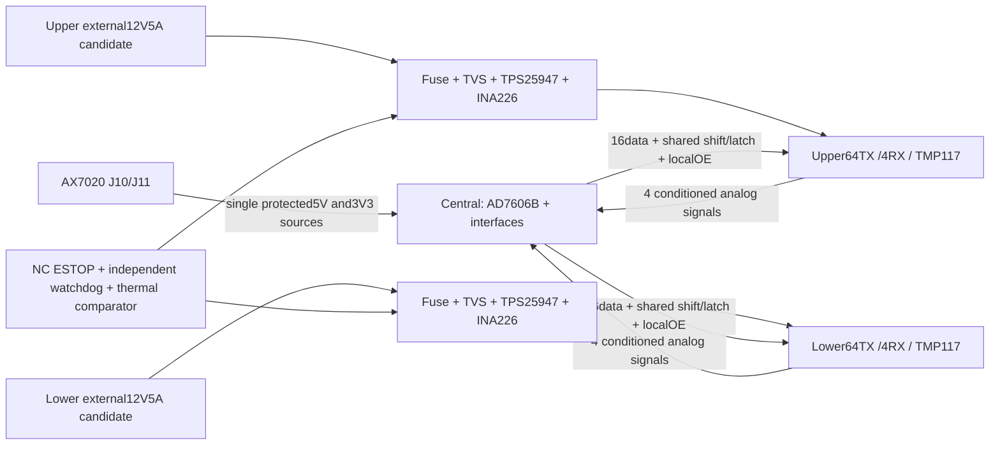
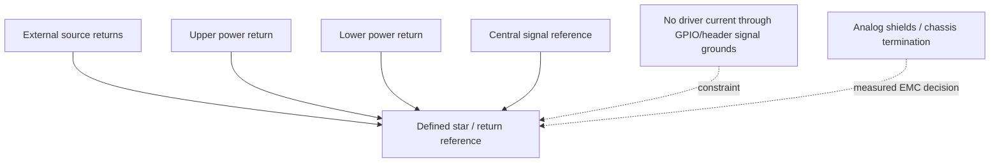

# Three-PCB hardware contract — candidate, not manufacturing release

One central board; two identical array assemblies, upper/lower. The user's
sketches establish functional areas and connector intent, not dimensions,
actual pin numbers, TX placement or a fabrication drawing. Array TX remain
8×8, x/y={−42,−30,−18,−6,6,18,30,42}mm,12mm pitch. Upper128-channel indices0–63
face−Z; lower64–127 face+Z. Face gap100mm, adjustable90–115mm. Nominal corner
RX at(±54,±54)mm are MECHANICAL_ASSUMPTION, not measured coordinates.

Central board has no external12V or independent5V input. Candidate single
rail sources are J10.2(+5V) and J10.39(+3V3), subject to Rev3 continuity,
current and return-path verification. All other power contacts are isolated
at the central PCB; never bridge J10/J11 rails together. Ground contacts may
be joined to a defined central signal reference after return/current review.
No power sourcing through signal pins. Reverse-current isolation, default-OFF
load switch, inrush and current limit must be sized from measured max/startup
loads. J10/J11 ratings and AX7020 spare power are UNKNOWN:
**CENTRAL_POWER_BUDGET_BLOCKED**. Do not substitute an external central supply
to hide an insufficient header budget. Board5V→5V LDO was removed from the
new candidate BOM because it has no dropout headroom.

Each array external12V5A label is a60W source capacity, not consumption or an
approved TX drive rating. Existing≈2A eFuse candidate is not a5A path. Actual
NU40C10T capacitance, continuous/burst Vpp, duty, frequency/temperature limits,
motional impedance and driver losses are unknown. `ax7020_power_budget.json`
contains a clearly hypothetical C/V/f sensitivity sweep only. Power, thermal,
wire, fuse, startup, current-waveform and utilization measurements are required.
SMBJ20A clamp coordination is HOLD; its label does not prove12V silicon safety.

Independent hardware shutdown must dominate both arrays: normally-closed
ESTOP loop loss, local thermal comparator, eFuse fault, cable loss and local
watchdog stop drive even if FPGA clock stops or PS hangs. External OE pullups
and eFuse EN pulldowns provide defaultOFF. GPIO buttons cannot replace this
path. Monitor source-side power availability separately from switched-driver
PGOOD to avoid demanding switchedPGOOD before enable. Physical timings,
unpowered behavior and comparator thresholds remain unverified.

The diagram is a return-path requirement, not galvanic isolation proof. Drivers'
high-current loops remain local to each array; RX low-noise returns and ADC
reference/analog ground need controlled layout. No floating RX input or
unspecified negative signal may touch AD7606B. Eight AFE chains require
measured bandwidth, gain, noise, phase, protection/clamp, settling and input
range; RX exact MPN is HOLD. Formal ADC remains **AD7606BBSTZ-RL**. The C-16
recommendation has not been adopted. NU40C10T TX remains fixed64 per array.

32 serial lanes use four outputs each on32×74HC595; remaining bits zero.
Shift/latch are common clock candidates66MHz shift; ADC clock candidate33MHz.
Neither rate is approved off-chip at3V3 without595/ADC/translator/delay/cable
min/max analysis and signal measurements. 595 logic supply and driver input
thresholds must match. SN74AXC8T245 supports low-voltage translation only,
not5V translation; both supplies must stay within its published0.65–3.6V
range. Verify partial-power-down/Ioff and controlled DIR/OE per direction.
Drivers may have12V supply with3V3 input only if their actual thresholds,
absolute maxima and unpowered behavior are satisfied. No unknown5V path to PL.

Central TMP1170x48 ADD0=GND, upper0x49 ADD0=V+, lower0x4B ADD0=SCL are
mandatory and recorded separately. Center SHT45AD1BR2 at0x44 is recommended;
RH is diagnostic until an approved humid-air model exists. Three dedicated
open-drain3V3 I2C segments avoid ambiguous address ownership; each array INA226
0x40 occupies its own segment. TCA4307 isolation candidates require powered/
unpowered and stuck-bus verification. Pullups are sized from measured bus
capacitance, never forced push-pull. Driver hotspot analog thermal cutoffs are
separate from board/air TMP117 compensation and cannot be replaced by it.

Harness candidate grouping: upper/lower each16data, sharedclock/latch, localOE,
heartbeat/cutoff/PGOOD, I2C pair, four analog+dedicatedreturns, shield and keyed
orientation. Pinmap harness fields are logical labels, not an approved wire
connector. Reserve ground interleaves for clocks and analog shield returns;
choose actual contact count and keyed connector after cable-length/SI analysis.
Single wire/connector faults must not enable either bank. Hot-plug, swap,
reverse polarity, interrupted returns, ESTOP and missing source require tests.

Button candidates from public/manual facts: PSKEY1 MIO50/B13 ARM, PLKEY1 N15
CAL and PLKEY2 N16 ABORT. Exact Rev3 verification is pending.≥1s longpress,
debounce/release, no auto-arm and both-bank fault latch are tested logically.
Current BD supervisory control is mediated through GPIO control bits; actual
physical button wiring, interrupt/CPU ownership and adapter are NOT_DEPLOYED.
